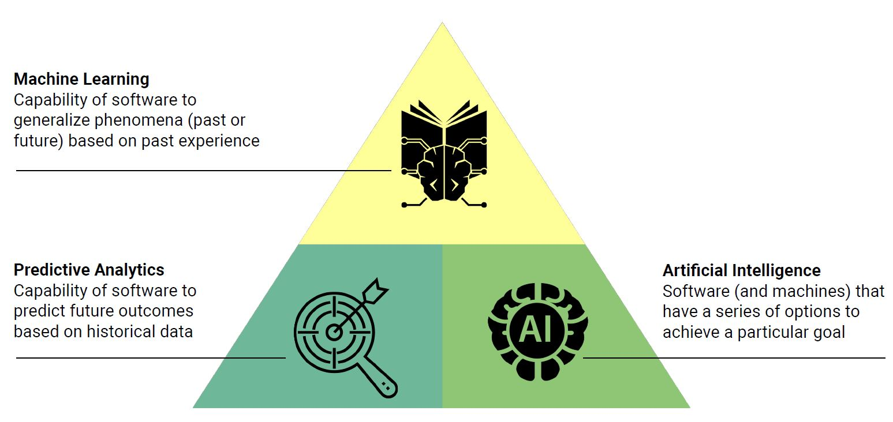
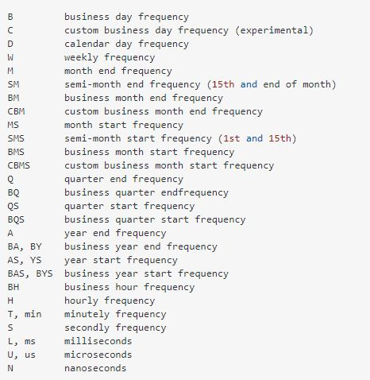
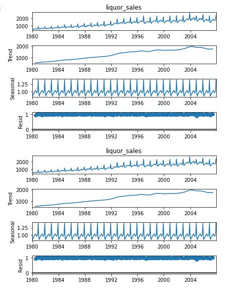
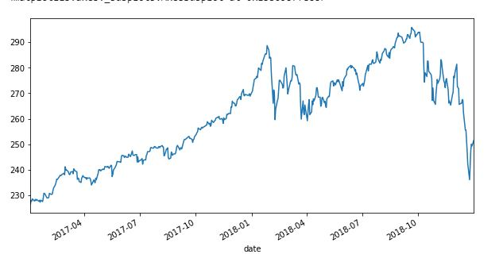
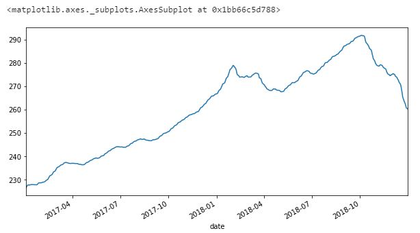
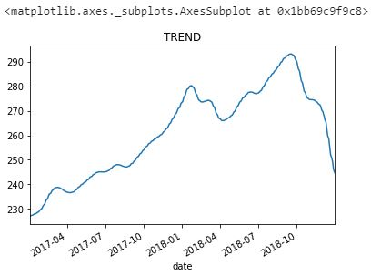
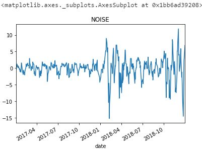
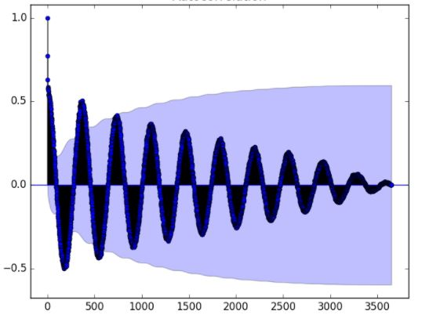
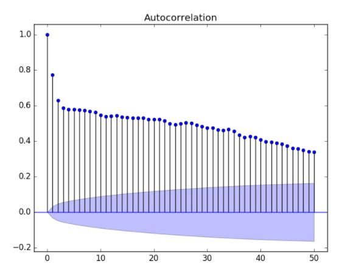
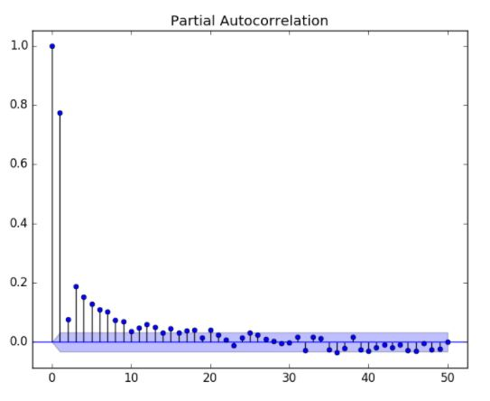

# Introduction to Machine Learning & Time Series Analysis

**Machine learning** is a programming approach allowing applications to learn from their inputs and make adjustments based on their outputs.

In a nutshell, machine learning, is developing statistical models that can make predictions or decisions on new data automatically.

*Machine Learning is used to predict:*

    Loan eligibility, foreclosure rates, and fraud.
    Disease diagnosis and prognosis.
    Consumer segmentation and clustering.
    Presidential election results.
    Natural disaster and planetary climate impacts.

" **Intelligent algorithms** are ones that use data to modify its behavior. Intelligent algorithms differ in that they can change their behavior as they run, often resulting in a user experience that many would say is intelligent."                          

They are ones that respond to data such that the algorithm gets better. It effectively
“evolves.” The decision is no longer deterministic given the event.

## 01- Time Series Basics
In Time Series Data, Data needs to be sliced and diced at various time frequencies in order to analyze data points as a time series (E.g. day, week, month, year). Pandas DateTimeIndex index can be used to help to slice & dice data, one of the 3 main used functions:

1- weekly = df['Close'].resample('W').mean(): 
[Pandas.DataFrmae.resample Documentation](https://pandas.pydata.org/pandas-docs/stable/reference/api/pandas.DataFrame.resample.html)

2- df.loc[2019]
[loc function: Pandas.DataFrame.loc Documentation](https://pandas.pydata.org/pandas-docs/stable/reference/api/pandas.DataFrame.loc.html)

3- df.iloc[2019]
[iloc function: Pandas.DataFrame.iloc Documentation](https://pandas.pydata.org/pandas-docs/stable/reference/api/pandas.DataFrame.iloc.html)

4-  resample function rules:
[resample function rules/stackoverflow](https://stackoverflow.com/questions/17001389/pandas-resample-documentation)
5- Numpy Array Reshaping:
[Numpy Array Reshaping with Examples](https://www.w3schools.com/python/numpy_array_reshape.asp)

## 02- Time Series Decomposition

Separation of a time series into useful and less useful components. The useful components can be used to observe patterns and to make predictions. Compnents are:

### 1- **Trend:** Is there an overall direction of movement? it is the upward or downward trend
### 2- **Periodicity:** Do patterns occur in cycles? it is the seasonality
### 3- **Residual:** How much noise exists in the data? it is the leftovers after trend & seasonality are omitted.

    To decompse the 3 components, we have to import statsmodels liabrary in python

    from statsmodels.tsa.seasonal import seasonal_decompose

you can have full insight  of statsmodel liabrary at:  [https://www.statsmodels.org/stable/gettingstarted.html](https://www.statsmodels.org/stable/gettingstarted.html)

The following plot to illustrate our Trend, Seasonality, & Noise in liquor sales example in Folder 01

## 03- Hodrick-Prescott Filter
A mathematical function that separates a time series into trend and non-trend components. It filters out short-term fluctuations, the following plot shows closing prices before smoothing  out noise

  ### *Exponentially Weighted Moving Average (EWMA)*
EWMA is an approach used to “denoise” or “smooth” out time series data so that trends and predictions can be made and to to see in which direction is the price moving?

   * it involves calculating the average of the last (n) prices 
   * Weights are added to the averages based on the recency of the data
      * Recent data is weighted more heavily
      * Weighting decreases exponentially for previous prices/time periods
   * Requires past average values to be stored in memory
  
  You can see in this plot, how the curve has been smoothed after using EWMA so we start using our filter
  

Next step is to apply Hodrick-Prescott Filter, so we can differntiate between the stock trend & noise, this can be done by using statsmodels as follows
    To decompse the 3 components, we have to import statsmodels liabrary in python

    import statsmodels.api as sm
    ts_noise, ts_trend = sm.tsa.filters.hpfilter(df['close'])

you can read more about Hodrick-Prescott Filter at  [statsmodels.tsa.filters.hp_filter.hpfilter](https://www.statsmodels.org/stable/generated/statsmodels.tsa.filters.hp_filter.hpfilter.html) & [Wikipedia](https://en.wikipedia.org/wiki/Hodrick%E2%80%93Prescott_filter)

## 04- Autocorrelation
Statistical correlation summarizes the strength of the relationship between two variables.

We can assume the distribution of each variable fits a Gaussian (bell curve) distribution. If this is the case, we can use the Pearson’s correlation coefficient to summarize the correlation between the variables.

The Pearson’s correlation coefficient is a number between -1 and 1 that describes a negative or positive correlation respectively. A value of zero indicates no correlation.

We can calculate the correlation for time series observations with observations with previous time steps, called lags. Because the correlation of the time series observations is calculated with values of the same series at previous times, this is called a serial correlation, or an autocorrelation.

A plot of the autocorrelation of a time series by lag is called the AutoCorrelation Function, or the acronym ACF. This plot is sometimes called a correlogram or an autocorrelation plot

    import statsmodels as sm
    from statsmodels.graphics.tsaplots import plot_acf, plot_pacf

Running the example creates a 2D plot showing the lag value along the x-axis and the correlation on the y-axis between -1 and 1.

Confidence intervals are drawn as a cone. By default, this is set to a 95% confidence interval, suggesting that correlation values outside of this code are very likely a correlation and not a statistical fluke.

By default, all lag values are printed, which makes the plot noisy.

**Partial Autocorrelation Function**
A partial autocorrelation is a summary of the relationship between an observation in a time series with observations at prior time steps with the relationships of intervening observations removed.

you can dig more in the Correlation, Auto-correlation at :
[Autocorrelation-Wikipedia](https://en.wikipedia.org/wiki/Autocorrelation#:~:text=Autocorrelation%2C%20also%20known%20as%20serial,the%20time%20lag%20between%20them.)
